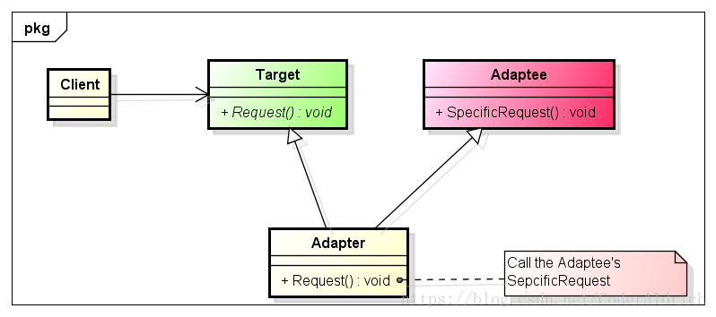
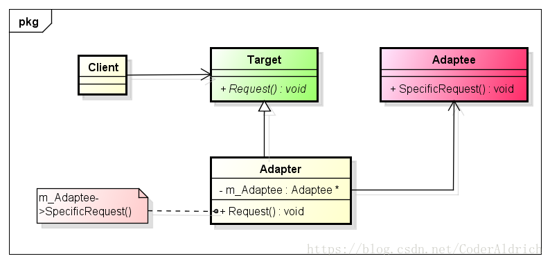

## 什么是适配器模式？

​       <https://blog.csdn.net/CoderAldrich/article/details/83115299> 

​       在GOF的《设计模式：可复用面向对象软件的基础》中是这样说的：将一个类的接口转换成客户希望的另外一个接口。适配器模式使得原本由于接口不兼容而不能一起工作的那些类可以一起工作。

​       好比日本现在就只提供110V的电压，而我的电脑就需要220V的电压，那怎么办啦？适配器就是干这活的，在不兼容的东西之间搭建一座桥梁，让二者能很好的兼容在一起工作。

## 为什么要使用适配器模式？

​      在软件开发中，有的时候系统的数据和行为都正确，但接口不符合，我们应该考虑使用适配器模式，目的是使控制范围之外的一个原有对象与某个接口匹配。

​     举个例子：在开发一个模块的时候，有一个功能点实现起来比较费劲，但是，之前有一个项目的模块实现了一样的功能点；但是现在这个模块的接口和之前的那个模块的接口是不一致的。此时，作为项目经理的你，该怎么办啦？当然是在中间加一层Wrapper了，也就是使用适配器模式，将之前实现的功能点适配进新的项目了。为什么呢？主要是使用适配器模式有以下优点：

1. 降低了去实现一个功能点的难度，可以对现有的类进行包装，就可以进行使用了；
2. 提高了项目质量，现有的类一般都是经过测试的，使用了适配器模式之后，不需要对旧的类进行全面的覆盖测试；
3. 总的来说，提高了效率，降低了成本

## 什么时候要使用适配器模式？

每一种设计模式都有它最适用的场合。适配器模式在以下场合下最适用：

1. 使用一个已经存在的类，如果它的接口和你实际要求的不一致时，可以考虑使用适配器模式；

2. 要在调用者和功能提供者双方都不太容易修改的时候再使用适配器模式，而不是一有不同时就使用它。

   

## UML

### 类适配器

适配器Adapter继承自Target和Adaptee类，Adapter类需要重写Target类的Request函数，在Request中做适当的处理，调用Adaptee类的SepcificRequest。最终，Target实际调用的是Adaptee的SpecificRequest来完成Request的，完成适配；这种叫做类适配器。

### 对象适配器

上图是适配器的第二种实现形式，适配器Adapter类继承自Target类，同时，在Adapter类中有一个Adaptee类型的成员变量；Adapter类重写Request函数时，在Request中，使用Adaptee类型的成员变量调用Adaptee的SpecificRequest函数，最终完成适配；这种叫做对象适配器。

## 类适配器和对象适配器的比较

既然有了类适配器和对象适配器，那么在实际中如何在二者之间做选择呢？

### 类适配器有以下特点：

1. 由于Adapter直接继承自Adaptee类，所以，在Adapter类中可以对Adaptee类的方法进行重定义；
2. 如果在Adaptee中添加了一个抽象方法，那么Adapter也要进行相应的改动，这样就带来高耦合；
3. 如果Adaptee还有其它子类，而在Adapter中想调用Adaptee其它子类的方法时，使用类适配器是无法做到的。

### 对象适配器有以下特点：

1. 有的时候，你会发现，不是很容易去构造一个Adaptee类型的对象；
2. 当Adaptee中添加新的抽象方法时，Adapter类不需要做任何调整，也能正确的进行动作；
3. 可以使用多态的方式在Adapter类中调用Adaptee类子类的方法。

由于对象适配器的耦合度比较低，所以在很多的书中都建议使用对象适配器。在我们实际项目中，也是如此，能使用对象组合的方式，就不使用多继承的方式。

