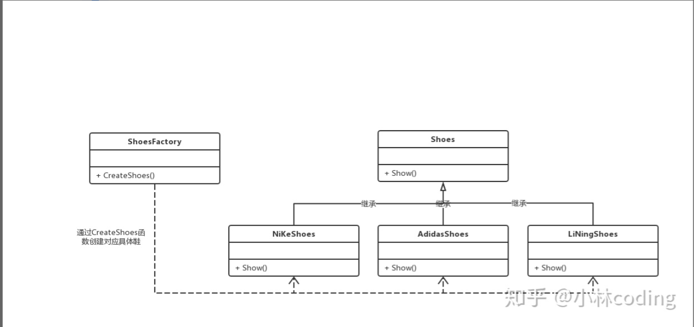
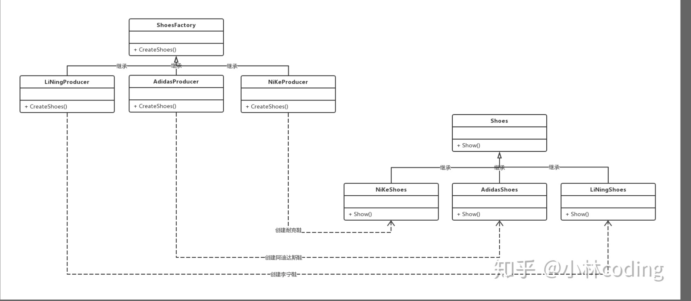
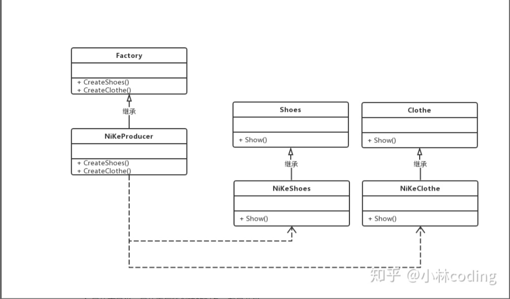

## 工厂模式

<https://zhuanlan.zhihu.com/p/83535678>

1. 介绍
  - 这种类型的设计模式属于创建型模式，它提供了一种创建对象的最佳方式
  - 在工厂模式中，我们在创建对象时不会对客户端暴露创建逻辑，并且是使用一个公共的接口来指向创建的对象。
2. 使用了c++多态的特性，将存在继承关系的类，通过一个工厂类创建对应的子类对象。在项目复杂的情况下，可以便于子类对象的创建。
3. 工厂模式可以分为简单工厂模式，工厂方法模式，抽象工厂模式

### 1 简单工厂模式

**具体的情形**
鞋厂可以指定生产耐克、阿迪达斯和李宁牌子的鞋子。哪个鞋炒的火爆，老板就生产哪个，看形势生产。

UML图：

**UML**

**简单工厂模式的结构组成**
1. 工厂类：工厂模式的核心类，会定义一个用于创建指定的具体实例对象的接口
2. 抽象产品类：具体产品类继承的父类（或接口）
3. 具体产品类：工厂类所创建的对象就是此具体产品实例

**特点**
工厂类封装了创建具体产品对象的函数

**缺陷**
扩展性差，新增产品时需要区修改工厂类

**代码**
simple_factory.cpp

### 2 工厂方法模式

**具体的情形**
现各类鞋子抄的非常火热，于是为了大量生产每种类型的鞋子，则要针对不同品牌的鞋子开设独立的生产线，那么每个生产线就只能生产同类型品牌的鞋。

**UML**

**工厂方法模式的结构组成**
1. 抽象工厂类：工厂方法模式的核心类，提供接口创建具体产品，有具体工厂类实现
2. 具体工厂类：继承抽象工厂，创建具体产品对象
2. 抽象产品类：具体产品类继承的父类（或接口）
3. 具体产品类：工厂类所创建的对象就是此具体产品实例

**特点**
- 抽象出了工厂类，提供接口创建具体产品的接口，交由子类实现
- 工厂方法模式的应用不只是为了封装具体产品对象的创建，而是要把具体产品对象放到具体工厂类中实现。

**缺陷**
- 每新增一个产品就要增加一个具体工厂类，相对于简单工厂，需要更多的类定义
- 一条生产线只能生产一个产品

**代码**
method_factory.cpp

### 3 抽象工厂模式

**具体的情形**
鞋厂为了扩大了业务，不仅只生产鞋子，把运动品牌的衣服也一起生产了。

**UML**

**抽象模式的结构组成**
1. 抽象工厂类：工厂方法模式的核心类，提供接口创建具体产品，有具体工厂类实现
2. 具体工厂类：继承抽象工厂，创建具体产品对象
2. 抽象产品类：具体产品类继承的父类（或接口）
3. 具体产品类：工厂类所创建的对象就是此具体产品实例

**特点**
- 可以创建多个产品对象

**缺陷**
- 每新增一个产品就要增加一个具体工厂类，相对于简单工厂，需要更多的类定义

**代码**
abstract_factory.cpp

### 4 模板工厂

**上述三种方法**
- 简单工厂模式违背了开闭法则，需要修改工厂类
- 后二者，需要增加具体工厂类，增加了代码量，

将工厂类的封装性提高，新增产品时，即不同修改工厂类，也不需新增具体的工厂类。封装性高的工厂类特点就是扩展性高，复用性也高。

**具体的情形**
针对工厂方法模式封装成模板工厂类，那么这样在新增产品时，是不需要新增具体的工厂类，减少了代码的编写量。

**UML**

### 5 产品注册类 + 单例工厂类

模板工厂类，新增产品虽然不需要新增具体的工厂类，但是缺少了一个类可以随时随地回去指定产品对象。

可以把产品的对象用std::map保存，通过key-value的方式可以轻松简单的获得对应产品对象。

**思路**
- 把产品注册的功能封装成产品注册模板类，注册的产品对象保存在工厂模板的std::map,便于产品的对象的获取
- 把获取产品对象的功能封装成工厂模板类。为了随时随地的获取指定产品对象，则把工厂设计成单例模式。

**UML**

**代码**
register_singleton_factory.cpp

 
